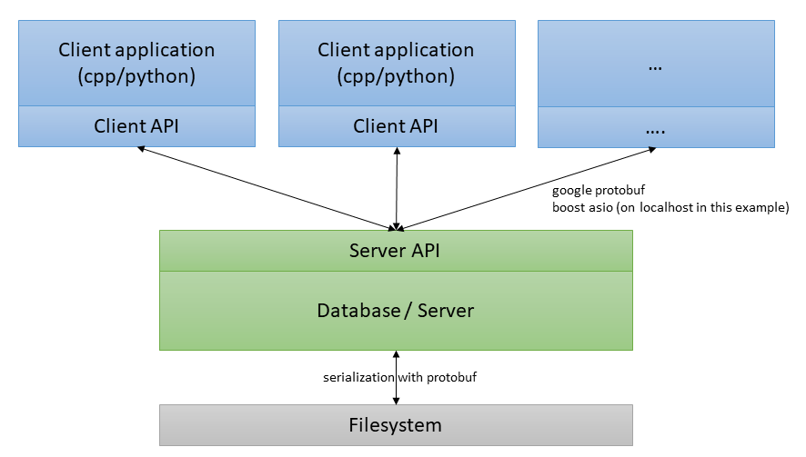

[](https://dev.azure.com/thomassedlmair/cppDatabase/_build/latest?definitionId=7&branchName=master)

# Database Example 

This database example runs a simple database to add and get keys and values. Keys and values are strings in this scenario. By installing the pythonDatabase.so, python access is also possible (e.g. in `./python_api/scripts/`). The server is created by using boost asio. For serialization and communication to clients google protobuf is used. The architecture is illustrated below.




## Build

To build and pre-install boost and protobuf. On Linux systems run following commands:

```bash
#boost 
sudo apt-get install libboost-all-dev
# protobuffer
git clone https://github.com/protocolbuffers/protobuf.git
cd protobuf
git submodule update --init --recursive
./autogen.sh

 ./configure
 make
 make check
 sudo make install
 sudo ldconfig # refresh shared library cache.
 ```

After installing depnendencies, create a build directory, build and install the project with cmake. By running install the python library (build for python 3.8) will be installed on your system.

```bash
mkdir build
cd build
cmake .. -G "Unix Makefiles"
make
sudo make install 
 ```


## Server / Database

The database is a key-value container which holds the data to an defined treshhold. By exceeding the treshhold the data will be written to the filesystem (see `./server/Constants.cpp` to change values accordingly).  

This server is implemented as least recently used cache and puts any value which was used to the end of the container.

  
The key values container is held by `Database` in `./server/Databse.hpp`, which is a singleton class and can be adjustet/extended with other containers. But in this example the server api and the protobuf definition is for string values exclusively. So if there are needs to change datatypes (e.g. holding keys as id's, etc.) change the implementation individually. 


## Client

The client api can easily used with following functions.

- Connect()
- Disconnect()
- Put(key, value) -> key and value as string
- Get(key) -> returns the value from the passed key as string
- Delete(key) -> deletes a value/key
- List() -> lists all keys/values on the server (std::cout)
